<!-- HEADER WAVE -->


<!-- ANIMATED TYPING SVG -->
<p align="center">
  <a href="https://github.com/2400031215-VarshithReddy">
    
  </a>
</p>

<!-- SOCIAL BADGES -->
<p align="center">
  <a href="https://github.com/2400031215-VarshithReddy">
    
  </a>
  &nbsp;
  <a href="https://linkedin.com/in/YOUR-LINKEDIN-ID">
    
  </a>
  &nbsp;
  <a href="mailto:your.email@example.com">
    
  </a>
  &nbsp;
  
  &nbsp;
  
</p>

---

<!-- ABOUT ME SECTION -->
### 👨‍💻 About Me

```python
class VarshithReddy:
    def __init__(self):
        self.name       = "Bhimavarapu Varshith Reddy"
        self.roles      = ["AI Alchemist", "Full-Stack Architect", "Flutter Explorer"]
        self.location   = "Andhra Pradesh, India 🇮🇳"
        self.education  = "B.Tech CSE @ KL University"

    def tech_stack(self):
        return {
            "mobile":  ["Flutter", "Dart", "Riverpod"],
            "web":     ["HTML", "CSS", "JS", "React", "Next.js"],
            "backend": ["Supabase", "Firebase", "PostgreSQL"],
            "ai":      ["Gemini API", "TFLite", "Python"]
        }

    def current_focus(self):
        return ["🔭 AI-powered mobile apps", "🌱 LLMs & Prompt Engineering",
                "👯 Open source collabs", "⚡ I debug with coffee ☕"]
```

---

<!-- GITHUB STREAK STATS -->
## 🔥 Streak Stats

<p align="center">
  
</p>

---

<!-- TECH STACK -->
## 🛠️ Tech Stack & Tools

<!-- Animated 3D Icons from TechStack Generator -->
<p align="center">
  
  
  
  
  
  
  
</p>

<!-- 3D-Style Badges -->
<p align="center">
  
  
  
  
  
  
  
  
</p>
<p align="center">
  
  
  
  
  
  
  
  
  
  
</p>

<details>
<summary><b>🔍 Full Stack Breakdown</b></summary>
<br/>

| Layer | Technologies |
|:------|:-------------|
| 📱 **Mobile** | Flutter 3.x · Dart · Material 3 · Riverpod · go_router |
| 🌐 **Web** | HTML · CSS · JavaScript · React · Next.js |
| 🗄️ **Backend** | Supabase · PostgreSQL · Row-Level Security · Realtime |
| 🔐 **Auth** | Supabase Auth · Phone OTP · JWT sessions |
| 🤖 **AI / ML** | Gemini API · TFLite · Camera Vision · Speech-to-Text |
| 🔔 **Notifications** | Firebase Cloud Messaging (FCM) · flutter_local_notifications |
| 🌤️ **APIs** | OpenWeather · Google Maps · Supabase Storage |
| 🔊 **Voice** | flutter_tts · speech_to_text · Telugu NLP |
| 📊 **Analytics** | fl_chart · Custom dashboards |

</details>

---

<!-- PACMAN CONTRIBUTION GRAPH -->
## 🕹️ Pac-Man Eats My Contributions!

<p align="center">
  <picture>
    <source media="(prefers-color-scheme: dark)" srcset="https://raw.githubusercontent.com/2400031215-VarshithReddy/2400031215-VarshithReddy/output/pacman-contribution-graph-dark.svg"/>
    <source media="(prefers-color-scheme: light)" srcset="https://raw.githubusercontent.com/2400031215-VarshithReddy/2400031215-VarshithReddy/output/pacman-contribution-graph.svg"/>
    
  </picture>
</p>

---

<!-- CONTRIBUTION ACTIVITY GRAPH -->
## 📈 Contribution Activity

<p align="center">
  
</p>

---

<!-- GITHUB STATS + TOP LANGUAGES -->
## 📊 GitHub Stats

<!-- Stats are auto-generated by the stats.yml workflow and committed to this repo -->
<p align="center">
  
  &nbsp;
  
</p>

---

<!-- MISSION STATEMENT -->
## 🌟 Mission Statement

<p align="center">
  
</p>

> _Passionate about building impactful software with **AI**, **Flutter**, and **modern web technologies**._
> _Turning ideas into elegant, production-ready applications._ 🚀

---

<!-- RANDOM DEV QUOTE -->
## 💬 Random Dev Quote

<p align="center">
  
</p>

---

<!-- FOOTER WAVE + CTA -->
<p align="center">
  <i>⚡ Open to internships, collaborations & research in AI · Full-Stack · Flutter · Web Development</i>
  <br/><br/>
  <a href="https://github.com/2400031215-VarshithReddy">
    
  </a>
</p>


